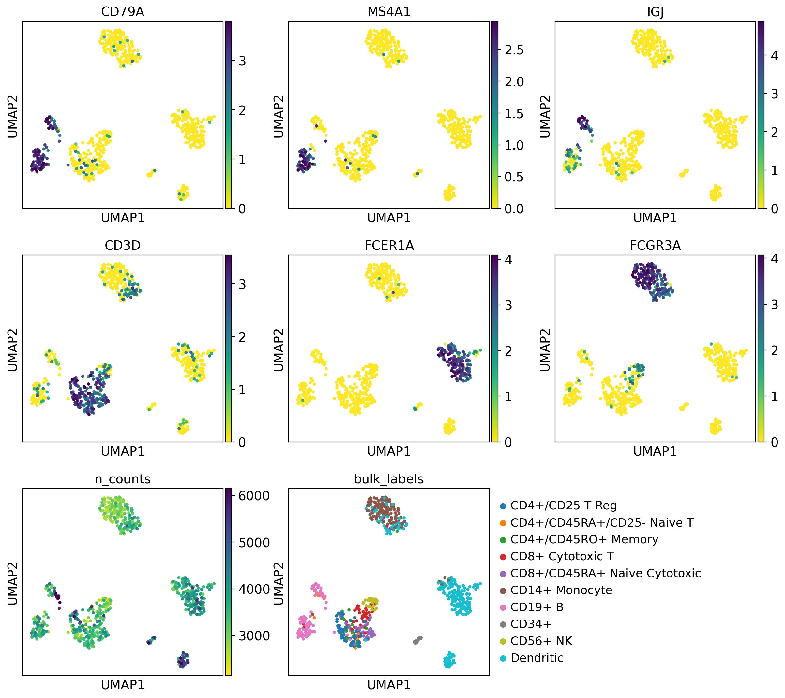
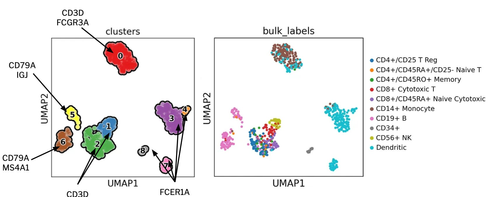
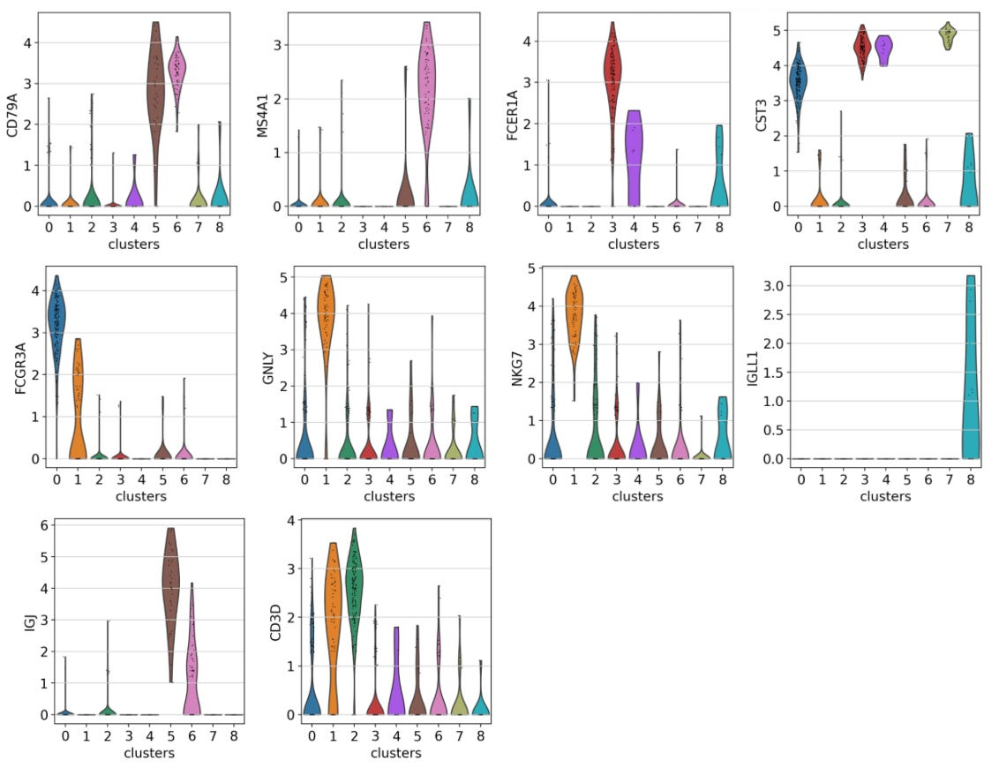
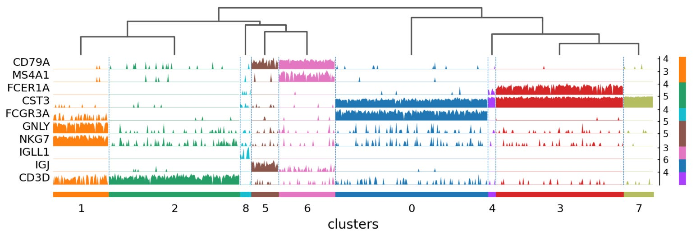
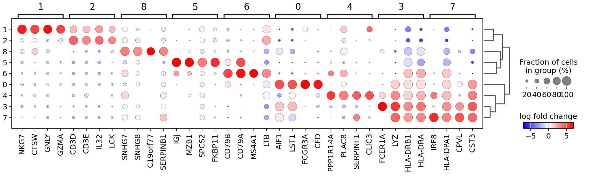

# 🧫 scanpy_tutorial
Identifying and visualizing marker genes with Scanpy

RNA-seq is a technique used to analyze the expression of genes in a biological sample that works by converting RNA molecules into complementary DNA (cDNA), sequencing this cDNA, and mapping the sequence data to a reference genome transcriptome to quantify gene expression levels. 

Whereas traditional bulk RNA sequencing provides an average gene expression profile for a population of cells, single-cell RNA-seq (scRNA-seq) allows for the study of gene expression at a single-cell level, providing insights into cellular heterogeneity and gene expression patterns within individual cells. As a result, scRNA-seq has diverse applications in studying disease mechanisms in specific cell types, identifying new drug targets, and discovering new biomarkers. 


# 🧫 Analyzing scRNA-Seq Data With ScanPy

Scanpy is a Python package that analyzes single-cell RNA sequencing (scRNA-seq) data. It provides a wide range of functionalities for preprocessing, analyzing, and visualizing scRNA-seq data, making it a powerful tool for researchers studying the complex biology of individual cells. While it is possible to perform scRNA-seq analysis without Scanpy, using the package can streamline the process and provide access to a range of advanced analysis tools and techniques, which is especially helpful for researchers new to single-cell genomics.

In this tutorial, I will demonstrate some of ScanPy's core functionalities using a reduced version of the 68k PBMC (peripheral blood mononuclear cell) dataset generated by the 10x Genomics platform. The reduced version of this dataset consists of 700 cells and 765 highly variable genes, making it easier for beginners like myself to analyze.

Importantly, this reduced dataset is preprocessed already, so we don't need to worry about quality control, filtering out low-quality cells and genes, normalizing counts, or batch correction. Additionally, UMAP dimensionality reduction has already been used on our dataset, allowing us to visualize the data in a lower-dimensional space while preserving its underlying structure, allowing us to explore the dataset right away.

Now, we can use the code below to setup our ScanPy work environment and load the PBMC dataset:
```
import scanpy as sc
sc.set_figure_params(dpi=100, color_map="viridis_r")
sc.settings.verbosity = 0
sc.logging.print_header()
pbmc = sc.datasets.pbmc68k_reduced()
pbmc
```
Below, you’ll find a step-by-step breakdown of the code block above:
- **import scanpy** as sc imports the ScanPy package and allows you to access its functions and classes using the sc alias. 
- **sc.set_figure_params(dpi=100, color_map=’viridis_r’)** sets the parameters for the figures generated by ScanPy. For example, dpi=100 sets the resolution of figures to 100 dots per inch, and color_map=’viridis_r’ sets the default color map. 
- **sc.settings.verbosity=0** sets the verbosity level of ScanPy. By setting it to 0, only critical messages are displayed, which reduces the amount of output displayed during analysis.
- **sc.logging.print_header()** prints a header to the console, indicating that the ScanPy system is active. This header typically includes information about the version of Scanpy being used, as demonstrated in the image below:
- **pbmc = sc.datasets.pbmc68k_reduced()** loads a pre-processed single-cell RNA sequencing datasets called pbmc68k_reduced, which is a subset of the Peripheral Blood Mononuclear cells (PBMCs) dataset, which is commonly used for benchmarking scRNA-seq analysis methods. 
- **pbmc** then provides a comprehensive overview of the scRNA-seq dataset, including information about individual cells, genes, clustering results, and dimensionality reduction.

# 🧫 Identifying Clusters By Marker Genes With UMAP Plots
After loading our PBMC dataset, we can use ScanPy’s built in functionality to visualize the expression of select marker genes that are highly expressed in specific cell types, making them useful for distinguishing between cell types based on their gene expression profiles. Below you’ll find a list of the various marker genes we’ll visualize in this section, followed by the cell types in the immune system that they are highly expressed in:
- **CD79A** and **MS4A1** are commonly used B-cell marker genes.
- **IGJ (JCHAIN)** is a marked gene that is highly expressed in plasma cells, which are a type of B-cell that produces antibodies.
- **CD3D** is a marker gene that is used to identify T-cells, which is a type of immune cell involved in cell-mediated immunity.
- **GNLY** and **NKG7** are marker genes that are often used to identify natural killer (NK) cells, which are a type of cytotoxic lymphocyte that plays a row in the immune response.
- **CST3** and **LYZ** are marker genes that are commonly used to identify myeloid cells, which are a group of immune cells that include monocytes, macrophages, neutrophils, and dendritic cells.
- **FCGR3A** is a marker gene that is often used to identify monocytes, which are a type of white blood cell that can differentiate into macrophages or dendritic cells.
- **FCER1A** is a marker gene that is commonly used to identify dendritic cells, which are antigen-presenting cells that play a key role in the immune response.

Now, to visualize the marker genes above, we will use a UMAP plot, which is a type of scatter plot that visualizes the high-dimensional gene expression data of individual cells in a lower-dimensional space while preserving the local and global structure of the data. In a UMAP plot, each point represents a single cell, and the position of the point in the plot is determined by the reduced dimensions calculated by the UMAP algorithm. Cells that are close together in the UMAP plot are more similar in their gene expression profiles, while far apart cells are more dissimilar. UMAP plots are commonly used in scRNA-seq analysis to visualize cell clusters, identify cell types, and explore the heterogeneity of cell populations. In the code below, I’ll demonstrate how to create a UMAP plot:

```
color_vars = ['CD79A','MS4A1','IGJ','CD3D','FCER1A','FCGR3A','n_counts', 'bulk_labels']
sc.pl.umap(pbmc, color=color_vars, s=50, ncols=3, vmax="p99")
```
The code block above uses ScanPy to create a UMAP plot with multiple color-coded annotations. Below, I’ll break the code down step by step:

- **color_vars = ['CD79A','MS4A1','IGJ','CD3D','FCER1A','FCGR3A','n_counts', 'bulk_labels']** is a list containing the names of our genes and other variables (i.e., n_counts and bulk_labels) that will be used to color the points on the UMAP plot. 
- **sc.pl.umap(pbmc, color=color_vars, s=50, ncols=3, vmax="p99")** creates a UMAP plot using ScanPy’s umap() function. Within the umap() function, we have multiple arguments, including pbmc, which is our dataset containing ssRNA-seq data, color=color_vars, which specifies the variable to use for coloring the UMAP plot, as well as additional parameters that specify the size of the plot, the number of columns, and the maximum color scale value (ensuring outliers do not overly influence the color scale).
  
The resultant plot can be seen below:


In the UMAP plot above, multiple subplots show the same cell positions but are colored differently based on the variables specified in our color_vars list. In each subplot, the color intensity of each point indicates the expression level or value of the corresponding variable, with darker colors indicating a higher expression or value. The plot allows for the visual comparison of different variables across the same set of cells, helping to identify patterns or relationships between the variables. For example, in the first subplot, we see the expression levels of CD79A, highlighting B-cells. The sixth subplot, on the other hand, shows the expression level of FCGR3A, highlighting the expression of monocytes.

Based on these subplots, we can start to guess what cell types the different regions of the subplots may represent. For example, seeing that the region in the bottom left corner of the subplots is darkened for CD79A and MS41A but not for other genes tells us that it may represent B-cells. To help make this more visually apparent, we can use Leiden clustering, a graph-based clustering algorithm used to identify distinct groups or clusters in single-cell RNA sequencing (scRNA-seq) data. The code block below demonstrates how to use ScanPy to perform Leiden clustering on the PBMC dataset and then create a UMAP plot with the cells colored according to their assigned clusters:

```
sc.tl.leiden(pbmc, key_added='clusters', resolution=0.5, n_iterations=2, flavor='igraph', directed=False)
sc.pl.umap(pbmc, color='clusters', add_outline=True, legend_loc='on data', legend_fontsize=12, legend_fontoutline=2, frameon=True)
```

Below, I’ll break the code down step by step:
- **sc.tl.leiden(pbmc, key_added='clusters', resolution=0.5, n_iterations=2, flavor='igraph', directed=False)
** is a function that performs Leiden clustering on the PBMC dataset. **key_added=’clusters’(( refers to the key in the pbmc.obs attribute (i.e., the observation metadata associated with each cell in the dataset) where the cluster assignments are stored, resolution=0.5 controls the granularity of the cluttering (a higher resolution leads to more clusters), n_iterations=2 is the number of iterations to refine the clustering (more iterations can lead to better results at the cost of increased compute time), flavor=’igraph’ specifies the version of the Leiden algorithm to use, and directed=False specifies whether the graph used for clustering is directed or undirected.
- **sc.pl.umap(pbmc, color='clusters', add_outline=True, legend_loc='on data', legend_fontsize=12, legend_fontoutline=2, frameon=True)
** is a function that creates a umap plot for the PBMC dataset, and color=’clusters’ specifies that the cells should be colors according to their cluster assignments stored in the ‘clusters’ key of pbmc.obs. The remaining inputs for the sc.pl.umap() function are used to adjust how the data is displayed in the visualization below, making it easier to interpret:


The UMAP plot above visually represents the clustering results from the above code, showing how cells are grouped into clusters based on their gene expression profiles. This type of plot is useful for exploring the heterogeneity of cell populations and identifying distinct cell types or states within a sample. Notably, cells that are close together in the UMAP plot are more similar in terms of gene expression profiles. For example, we can assume that cluster 0 primarily represents monocytes, clusters 1-2 are dominated by T-cells, 3-4 and 7-8 by macrophages or dendritic cells, and 5-6 by B-cells, as demonstrated in the images below:



# 🧫 Other Methods For Identifying Clusters By Marker Genes

In the previous section, we explored using scatter plots to visualize gene expression and link it to specific clusters in your data. However, there are several other methods for identifying clusters by marker genes, such as dot plots, violin plots, heatmaps, and tracks plots. While these visualizations convey the same information, each offers a unique perspective. Understanding how to use these tools is valuable because viewing data from different angles can lead to different interpretations. 

To begin, we’ll create a dictionary to store our cell types and their associated marker genes as key-value pairs, as demonstrated below:

```
marker_gene_dictionary = {'B-cell':['CD79A','MS4A1'], 'Dendritic': ['FCER1A','CST3'], 'Monocytes':['FCGR3A'], 'NK':['GNLY','NKG7'], 'Plasma':['IGJ'], 'T-cell':['CD3D'], 'Other':['IGLL1']}
```

**Dot Plot:**
Next, we’ll create a dot plot to visualize the expression of the aforementioned marker genes per cluster, using the code below:

```
sc.pl.dotplot(pbmc, marker_gene_dictionary, 'clusters', dendrogram=True)
```


The dot plot visualizes the expression of marker genes for each cluster. Each row in the dot plot above represents a cluster, and each column represents a marker gene. Additionally, the color and size of the dots represent their mean expression level and the fraction of cells in each cluster expressing the gene, respectively. Thus, marker genes that are specific to or highly expressed in a particular cluster will appear as large, dark dots in the corresponding column for that cluster. The dot plot above also has a dendrogram displayed on the side, which brings together similar clusters using the correlation of the PCA components between the clusters, helping to identify clusters of marker genes and clusters of cells that share similar expression patterns.

**Violin Plot:**
A violin plot is a type of data visualization that provides a visual summary of the distribution of expression levels for each marker gene across different clusters, helping to identify genes that are differentially expressed between clusters and gain insights into the heterogeneity of cell populations. The code below demonstrates how to generate a violin plot:

```
sc.pl.violin(pbmc, ['CD79A', 'MS4A1', 'FCER1A', 'CST3', 'FCGR3A', 'GNLY' ,'NKG7','IGLL1', 'IGJ', 'CD3D'], groupby='clusters')
```



When interpreting a violin plot, there are three primary things we’re looking at: the x-axis, y-axis, and violin shape. The x-axis represents the clusters specified in the group by argument in the code above, the y-axis represents the expression level of specific marker genes, and the violin shape represents the distribution of expression levels for a specific marker gene within a cluster. The width of the plot at each expression level indicates the density of cells with that expression level. Additionally, the height and width of the violin plot show the range and density of expression levels for each marker gene within each cluster.

**Heat Maps and Tracks Plots:**

In this final sub-section, I’ll show you how to use heat maps and track plots to identify clusters by marker genes. Both heat maps and track plots represent data in a matrix format, allowing for simultaneous visualization of multiple genes and samples, making it easier to identify co-regulated genes and differences in expression levels. In the block block below, I’ll show you how to generate a heat map using ScanPy:

```
sc.pl.heatmap(pbmc, marker_genes_dictionary, groupby='clusters', dendrogram=True, swap_axes=True,  figsize=(11, 5))
```


When interpreting a heat map, darker colors (purple in this case) generally indicate higher gene expression levels than lighter colors (yellow). Additionally, the intensity of color reflects the magnitude of gene expression, with more intense shades of a given color representing higher expression. Additionally, it’s important to look for gene expression patterns across clusters, noting that genes with similar expression patterns may be functionally related or co-regulated.

Now, a track plot presents the same information as a heat map but with a twist. Instead of using a color scale to represent gene expression, it employs tracks where gene expression is represented by height. This unique feature sets it apart from a heat map. The code below demonstrates how to create a track plot in ScanPy:

```
sc.pl.tracksplot(pbmc, marker_genes_dictionary, groupby='clusters', dendrogram=True)
```


Because heat maps and track plots convey the same information, choosing between using one or the other is simply a matter of preference. Personally, I prefer track plots and find it easier to compare changes in gene expression based on differences in height versus shade of colors.

# 🧫 Identifying Marker Genes By Clusters

In the previous sections, I provided a guide on characterizing clusters using known, pre-defined marker genes. Now, in this final section, we delve into the reverse process— how to identify marker genes that are differentially expressed between clusters or cell types, which is applicable in various research contexts, particularly in the discovery of biomarkers.

As with the previous section, we have many options when selecting the type of plot to best identify new marker genes. The choice between one or the other ultimately comes down to understanding the advantages and limitations of any given plot type. While it's worth exploring all sorts of data visualizations when identifying marker genes by clusters, I'll use dot plots for simplicity's sake in this section. The code block below demonstrates how to calculate differential gene expression rankings between clusters, which will be used in the subsequent data visualization:

```
sc.tl.rank_genes_groups(pbmc, groupby='clusters', method='wilcoxon')
```

Now, let’s break this code down step-by-step to see how it works:
-The function **sc.tl.rank_genes_groups(pbmc, …etc.)** is used to perform differential gene expression analysis in ScanPy using the pbmc dataset. 
- The **groupby=’clusters’** variable in the function call specifies the key in the pbmc.obs attribute that defines the groups for comparison. 
- Finally, **method=’wilcoxon’** specifies the statistical test used to compare gene expression between groups.

After performing differential expression analysis using the code above, we can use a dot plot visualization to get an overview of the genes that are differentially expressed. Notably, we’ll plot log-fold changes instead of gene expression since log-fold changes provide a more stable, normalized, and interpretable measure of differential gene expression, making it a standard approach in RNA-seq and other high-throughput sequencing analyses.

```
sc.pl.rank_genes_groups_dotplot(pbmc, n_genes=4, values_to_plot= 'logfoldchanges', min_logfoldchange=3, vmax=7, vmin=-7, cmap='bwr')
```

The code above uses ScanPy’s sc.pl.rank_genes_groups_dotplot( ) function to create a dot plot showing the expression of the top differentially expressed genes between clusters in the pbmc dataset. Below, I’ll break down the arguments in this function:
- **n_genes=4** species the number of top differentially expressed genes to plot for each cluster. 
- **values_to_plot=’logfoldchanges’** specifies that we’ll plot the log-fold gene expression changes between clusters in our dot plot. 
- **min_logfoldchange=3** is the minimum log gold change to include in the plot. Thus, genes with a log-fold change below this threshold won’t be plotted. 
- **vmax=7** and **vmin = -7** refer to the dot plot's maximum and minimum values on the color scale. Genes above and below the max and min values for log-fold change will have the highest and lowest possible color codings in the color map specified by the attribute cmap=’bwr’.



Each column in the dot plot above represents a cluster, and clusters are grouped in four-column bunches. Within each cluster, you find the four top genes, which have the highest log-fold changes in gene expression, with the size and color of a dot indicating the magnitude and degree of expression. For example, in cluster seven, we see that IRF8, HLA-DPA1, CPVL, and CST3 are the selected genes with the greatest log-fold change in expression indicated by large red dots and that these same genes have a negative log-fold change in expression in clusters 1,2,5 and 8. Importantly, this analysis has revealed multiple genes not included in our initial list of marker genes, providing us with new potential biomarkers for identifying specific cell types.
